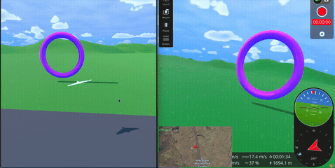
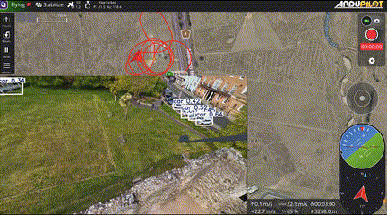
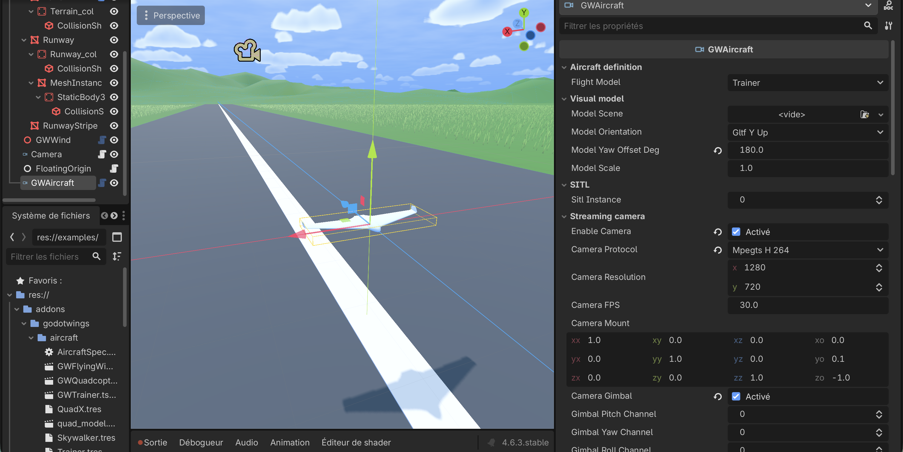

# GodotWings

|  |  |  |
|:--:|:--:|:--:|


A cross-platform flight simulator built in Godot 4 that acts as the physics +
render backend for [ArduPilot SITL](https://ardupilot.org/dev/docs/sitl-simulator-software-in-the-loop.html)

An alternative to Gazebo / AirSim, which can be heavy to setup when needing a simple SITL + Computer Vision setup.

It ships as a Godot addon. Simply add it to your project, drop a few nodes and you're ready to fly.


## Running

### Godot side

Install [Godot 4.2+](https://godotengine.org/download), create / open a project and import GodotWings as an addon (addons/godotswings). 
- GWAircraft and GWMulticopter nodes provide drag-and-drop, fully setup aircrats with dynamics, SITL endpoint, camera streaming (rtsp...) and gimbal. All easy to setup in the inspector
- GWView camera allows you to setup an in-Godot camera when not using the streaming camera attached to the drone 
- GWWind provides very basic wind / turbulence 
Examples/Main.tscn provides the most basic example. 
- GWFloatingOrigin provides Floating origin (origin rebasing) for large worlds. Drop in level and point to your main drone.

default mavlink endpoint: udp:127.0.0.1:14550
and video stream: 127.0.0.1:5600

 

### ArduPilot side


```bash
docker compose up --build                    # ArduPlane for GWAircraft
NUM_VEHICLES=2 docker compose up # For multiple vehicle, see "#swarm"
VEHICLE=ArduCopter docker compose up --build  # ArduCopter for GWMulticopter
```

**Start Godot before the container** — ArduPilot's JSON backend blocks waiting for physics and emits no MAVLink until Godot is replying. If the container starts
first, `docker compose restart ardupilot-sitl` once Godot is running.

You can then use your ground control software of choice (tested with QGroundcontrol) to fly the drone and view the live video.


## Manual / direct control (no SITL)

You don't need ArduPilot to fly. Every vehicle has a `control_source` property:

- **SITL** (default) — driven by ArduPilot over the UDP lockstep bridge.
- **Manual** — driven directly by keyboard / joypad / USB RC controller.

Set `control_source = Manual` on a `GWAircraft` / `GWMulticopter` (or drop a
`GWManualInput` node under any vehicle body) and run Godot on its own — no Docker,
no autopilot. A `GWManualInput` is added automatically when none is present.

Default controls (RC "mode 2"; all rebindable in *Project Settings → Input Map*,
the `gw_*` actions):

| Input | Keyboard | Joypad |
|---|---|---|
| Roll (aileron) | ← / → | right stick X |
| Pitch (elevator) | ↑ / ↓ | right stick Y |
| Yaw (rudder) | A / D | left stick X |
| Throttle | W / S | left stick Y |
| Reset / un-crash | R | — |

Throttle is **sticky**: it ramps up/down while you hold the key/stick and holds
where you leave it (set `throttle_ramp`). If a control responds backwards for your
airframe, flip the matching `invert_*` flag.

Manual mode is **raw and unstabilised** — sticks map straight to channels 1–4 in
the AETR layout. A fixed-wing flies this directly (it's a real RC "manual" mode:
surfaces deflect, no auto-level). A **multirotor receives channels 1–4 as raw
per-motor servos**, exactly as it would from SITL, so it is *not* hand-flyable as-is
— layer your own mixer / flight-mode sim on top of `GWManualInput` if you want
stabilised quad control. Aux channels (5–16) rest at neutral, so `GWChannelSwitch`
still works against a manual source.

See `examples/Manual.tscn` for a runnable fixed-wing setup.


## Camera & gimbal

`GWCamera` (`sensors/Camera.gd`) renders an off-screen viewport sharing the main
world, grabs frames on a timer to a local TCP server, and lets ffmpeg pull them
and emit H.264 (RTP — QGroundControl's native format — / MPEG-TS / RTSP). A
parallel UDP socket emits one JSON packet per frame (`frame_id`, `sim_time` on the
SITL clock, `pos_ned`, attitude quaternion, fov, mount basis) so a CV process can
correlate video to ground-truth pose. The video path is independent of the SITL
bridge — it only reads pose and never blocks the physics loop.

Add a `GWCamera` under a vehicle (or tick `enable_camera`). Its transform is the
mount; identity looks out the nose, −90° about X looks straight down. Needs
`ffmpeg` on `PATH` (or set `ffmpeg_path`); `launch_ffmpeg = false` runs your own
encoder against the raw-frame TCP server. Reference CV client:

```bash
pip install opencv-python pymavlink numpy
python3 tools/gw_camera_client.py --video user://godotwings_cam.sdp --mavlink udp:127.0.0.1:14550 --show
```

The camera can also act as an ArduPilot **servo gimbal** that follows any mount
mode (MAVLink angle/rate, ROI/GPS, Home, SysID, RC) commanded from the GCS — no
MAVLink parsing in Godot. Configure the mount as a servo gimbal and ArduPilot
resolves the active mode into pitch/yaw/roll servo PWM that arrives over the SITL
link; `GWCamera` reads those channels. Tick `gimbal_enabled`, set the channels to
match your `SERVOn_FUNCTION`, and set the angle ranges to match `MNT1_*_MIN/MAX`.
`docker/sitl-defaults.parm` includes a ready servo-mount block:

```
MNT1_TYPE        1     # servo gimbal
MNT1_DEFLT_MODE  2     # MAVLink targeting
SERVO9_FUNCTION  7     # mount pitch -> ch 9
SERVO10_FUNCTION 6     # mount yaw   -> ch 10
SERVO11_FUNCTION 8     # mount roll  -> ch 11
```

## Wind, collision & crash

`GWWind` — drop one in the world and every vehicle auto-finds it. Mean wind
(`wind_speed` + `wind_from_deg`, METAR-style bearing it blows from), optional
altitude shear (power law), and optional turbulence (band-limited sum-of-sinusoids
gusts — cheap, deterministic, good for disturbance-rejection testing). The wind
shifts the airspeed the aero sees and is reported to ArduPilot's windvane.

Collision is layered on by querying Godot's physics (the vehicle is not a
`RigidBody3D`, so the validated FDM is untouched):

- `terrain_following` — a downward raycast (`ground_collision_mask`) gives the
  ground height + normal, so the gear/roll-out/crash logic follows 3D terrain.
- `obstacle_mask` — the hull is shapecast against these layers each frame; any
  contact is a crash.
- `aircraft_layer` — set the same non-zero layer on every vehicle for air-to-air
  collision (both crash on overlap).
- `crash_mode` — **Ragdoll** hands the wreck to the physics engine for a real
  tumble (read back into the SITL state, then recovered once it settles);
  **Simple** runs a scripted decelerate-and-settle.

Vehicles emit `took_off` / `landed` / `crashed` / `recovered` /
`controls_received(channels)`. Channels 1–4 are flight controls; 5–16 are free —
map an aux switch to a servo output and a `GWChannelSwitch` turns it into Godot
signals (drop payload, lights, gear…). Read any channel with `control_norm(ch)` /
`control_pwm(ch)`.

## Swarm

Run several vehicles, each ArduPilot instance paired with its own Godot vehicle on
ArduPilot's per-instance convention: vehicle `i` ↔ JSON physics on `9002 + 10·i`.
Add one `GWAircraft` per vehicle with `sitl_instance = 0, 1, 2…` (give each a
distinct `spawn_north`/`spawn_east`), and on the SITL side:

```bash
NUM_VEHICLES=4 docker compose up --build
```

This launches `-I 0..3` and sends MAVLink to `14550, 14560, …` (one comm link per
vehicle). With `NUM_VEHICLES > 1` the instances run headless.

## License

MIT. The stylized sky in `examples/World.tscn` uses GDQuest's
[godot-4-stylized-sky](https://github.com/gdquest-demos/godot-4-stylized-sky)
shader (MIT procedural resources only — no CC-BY-NC-SA art); see
[examples/sky/CREDITS.md](examples/sky/CREDITS.md).
